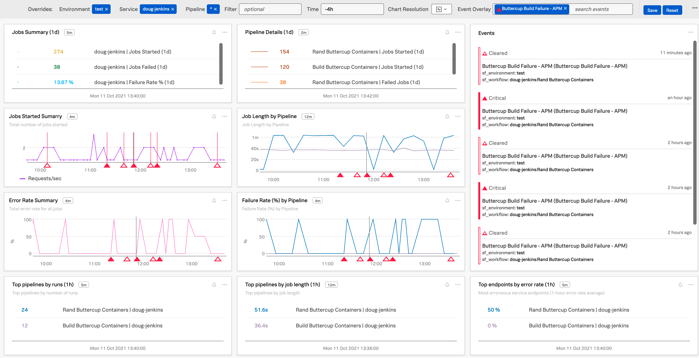
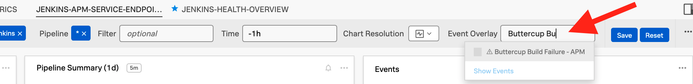
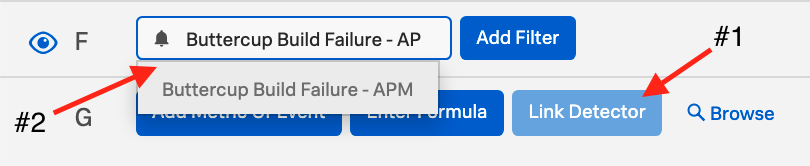
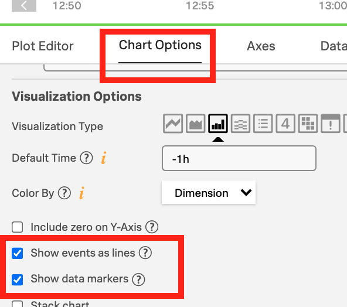

# Jenkins-OTEL-Notes-Gists

## How can we use the Jenkins OTEL plugin to get data in to Splunk?

- [Jenkins OTEL plugin](https://plugins.jenkins.io/opentelemetry/#getting-started) (by Cyrille Le Clerc) can be used with an [OTEL collector](https://github.com/signalfx/splunk-otel-collector) to send APM data to Splunk Observability Cloud (formerly SignalFx) APM, and Splunk HEC
    - Quick linux install of Splunks OTEL collector: 
        ```
            curl -sSL https://dl.signalfx.com/splunk-otel-collector.sh > /tmp/splunk-otel-collector.sh && \
            sudo sh /tmp/splunk-otel-collector.sh --realm $SPLUNK_REALM -- $SPLUNK_ACCESS_TOKEN
        ```
- **NOTE:** For traditional Build Logs it is possible to run an OTEL agent on the Jenkins instance and send build logs through OTEL as well

## What does the OTEL config look like? 

- **NOTE:** OTEL can be setup to send APM data to Splunk APM, Spunk Enterprise HEC, Splunk Log Observer, or all three! Config below is for sending to all three.

1. Config for [Splunk Otel Variables](./splunk-otel-collector.conf) (default location on install is `/etc/otel/collector/splunk-otel-collector.conf`)

2. Config for [OTEL Agent](./agent_config.yaml) (default location on install is `/etc/otel/collector/agent_config.yaml`)
    - Pay special attention to the additional `environment` attribute / tag we're adding to each trace. SignalFX APM utilizes this attribute by default
        ```
        attributes:
            actions:
            - key: environment
            value: test
            action: insert
        ```
    - Also pay attention to the `transform` processor and `spanmetrics` connector settings which allows us to create time series metrics out of our APM data for detailed historical tracking of trends in individual spans/steps.
        ```
        processors:
          # Transform processor to enrich jenkins span data
          transform/jenkinstrace:
              trace_statements:
                - context: span
                    statements:
                    - set(attributes["jenkins.pipeline.step.name"], name) where attributes["jenkins.pipeline.step.name"] == nil  
                    - set(attributes["jenkins.pipeline.step.type"], name) where attributes["jenkins.pipeline.step.type"] == nil
        ```
        ```
        connectors:
          # spanmetrics connector will pull span metrics out of our trace data with dimensions for pipeline id, step name, step type.
          # Any other dimensions (span tags) can also be added here to put those dimensions onto the spanmetrics
          spanmetrics/jenkins:
            histogram:
            explicit:
                buckets: [1ms, 10ms, 100ms]
            dimensions:
            - name: ci.pipeline.id
                default: None
            - name: jenkins.pipeline.step.name
                default: None
            - name: jenkins.pipeline.step.type
                default: None
            dimensions_cache_size: 1000
            namespace: jenkins 
        ```
    - Finally we use both of these in our service pipelines to process the trace data with `transform`, output it through the `spanmetrics` connector and send the created metrics to Splunk Observability. 
        ```
        pipelines:
        traces:
            receivers: [otlp/jenkins]
            processors:
            - transform/jenkinstrace
            - memory_limiter
            - attributes  
            - batch
            - resourcedetection
        metrics:
            receivers: [otlp, signalfx, spanmetrics/jenkins]
            processors: [memory_limiter, batch, resourcedetection]
            exporters: [signalfx]        
        ```
## OTEL collector is setup. I've installed the Jenkins OTEL plug using the Jenkins Plugin Manager. How do I configure the Jenkins OTEL plugin?
- Add your OTEL Collector Instance's IP and the appropriate port to the `OTLP GRPC ENDPOINT` field in Manage Jenkins > Configure System.  
    - Default port: `4317`
        - Note: In this example we will use the default port for jenkins data specifically. If you are sending other otlp data to port `4317` open another port for jenkins and change the port for `otlp/jenkins` in the receiver config.
        - If needed verify open ports on the opentelemetry collector instance:
            ```
            # sudo netstat -tulpn | grep LISTEN        
            tcp6    0   0 :::22         :::*        LISTEN   507/sshd            
            tcp6    0   0 :::9943       :::*        LISTEN   9768/otelcol        
            tcp6    0   0 :::8888       :::*        LISTEN   9768/otelcol        
            tcp6    0   0 :::9080       :::*        LISTEN   9768/otelcol        
            tcp6    0   0 :::14268      :::*        LISTEN   9768/otelcol        
            tcp6    0   0 :::4317       :::*        LISTEN   9768/otelcol      
            tcp6    0   0 :::55681      :::*        LISTEN   9768/otelcol        
            tcp6    0   0 :::9411       :::*        LISTEN   9768/otelcol  
             ```

- Settings in Jenkins OpenTelemetry Plugin  
    - **OTLP GRPC Endpoint**: http://instance.ip.goes.here:4317
    - **Authentication**: Choose appropriate options for your tokens (or the No Authentication option if you must)
    - **Visualisation**:
        - **Custom Observability Backend**
            - **Name**: `Splunk APM (SignalFX)`
            - **Trace visualisation URL template**: https://app.us1.signalfx.com/#/apm/traces/${traceId}
    
- Click the `Advanced...` button to open up dialogs to set an APM `Service name` and `Service namespace`

## I've verified traces are going in to Splunk APM. Where should I see my Jenkins Instance in Splunk APM?
- Splunk APM will show your Jenkins instance as the same value you have input in The Jenkins OpenTelemetry Plugin setup's `Service name` and `Service namespace` settings
- Each of the Pipelines running in the Jenkins instance will be treated as a Service Endpoint in Splunk APM
- Basic [Jenkins dashboards](./dashboards/) are included in this repository as a starting point
    1. Filter by your environment variable
    2. Filter by your Jenkins Service Name
    3. Filter by your Pipeline (or * for all pipelines)
    4. Edit Event Overlay to match detectors (I.E. Detector for build failures)


## Using OTEL connectors and processors to get a better overview of the Overall Jenkins Health and specific metrics around individual steps over time
To create time series metrics from your Jenkins APM data use the OTEL `transform` processor and `spanmetrics` connector to metricize the APM span data. This allows you to plot those values historically even if your Jenkins APM data has aged out of Splunk APM.
- **Note:** This requires enhancing your OTEL Collector config to send the Jenkins APM data through the `transform` processor and `spanmetrics` connector as detailed [above](#what-does-the-otel-config-look-like)


## How can I Setup a detector on Jenkins deployments using OTEL data? 
1. Create a detector [using the V2 detector url](https://app.us1.signalfx.com/#/detector/v2/new) to leverage a SignalFlow query.
    - Example SignalFlow for Service Name: `jenkins-service` and Workflow (pipeline): `Scheduled Buttercup Containers Build` in the `test` environment:
    ```
    AllReq = data('workflows.count', filter=filter('sf_workflow', 'jenkins-service:Scheduled Buttercup Containers Build') and filter('sf_environment', 'test') and (not filter('sf_dimensionalized', '*'))).sum(by=['sf_workflow']).publish(label='Success', enable=False)
    Error = data('workflows.count', filter=filter('sf_workflow', 'jenkins-service:Scheduled Buttercup Containers Build') and filter('sf_environment', 'test') and (not filter('sf_dimensionalized', '*')) and filter('sf_error', 'false')).sum(by=['sf_workflow']).publish(label='Error', enable=False)
    ErrRate = (100*(AllReq-Error)/AllReq).publish(label='ErrRate')

    from signalfx.detectors.apm.workflow_errors.static_v2 import static as workflow_errors_sudden_static_v2
    workflow_errors_sudden_static_v2.detector(filter_=((filter('sf_workflow', 'jenkins-service:Scheduled Buttercup Containers Build'))) and (filter('sf_environment', 'test')), custom_filter=None, current_window='30m', fire_rate_threshold=0.1, clear_rate_threshold=0, attempt_threshold=1).publish('Buttercup Build Failure - APM')
    ```
    - Note: other dimensions such as `sf_service` (I.E. Jenkins service name) and `sf_operation` (I.E. pipeline name) can also be used along with metrics like `spans.count` to create detectors
2. Add your detector to the Event Overlay for your dashboards and charts!
    - Dashboard Overlay Example:
    
    - Single Chart Overlay Example:
        1. In your Chart click `Link Detector
        2. Type your Detector name into the box and select it
        
        3. Click the `Chart Options` tab and select `Show events as lines` and `Show data markers` 
        
- **PRO-TIP:** Detectors can also be added for another team's deployments if the health of your own could be impacted by a failed deployment.
